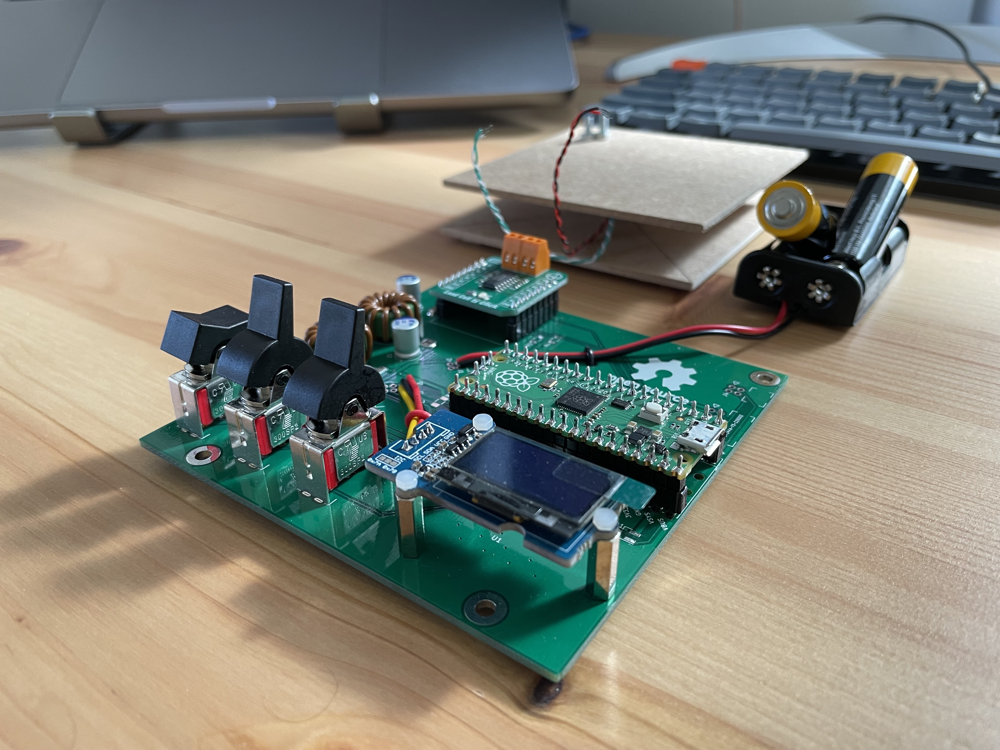

# Kitchen / coffee scale

This is a kitchen / coffee scale project repository. Contains both the hardware design files and the firmware source code.

## Prototype one

- [Raspberry Pi Pico](https://www.raspberrypi.com/products/raspberry-pi-pico/)
- Firmware in Rust ([escale_fw_rs](escale_fw_rs/))
- Battery powered (AA×2)

## Prototype zero

The firmware source code is at a very early stage of development. See [escale_fw](escale_fw).

The hardware prototype is assembled on a breadboard and consists of the following components:

- [Seeeduino XIAO](https://wiki.seeedstudio.com/Seeeduino-XIAO/)
- [0.96" SSD1315 OLED display](https://wiki.seeedstudio.com/Grove-OLED-Display-0.96-SSD1315/)
- [MikroE Load Cell 2 Click](https://www.mikroe.com/load-cell-2-click)
- Two 12 mm THT-mount push-buttons

